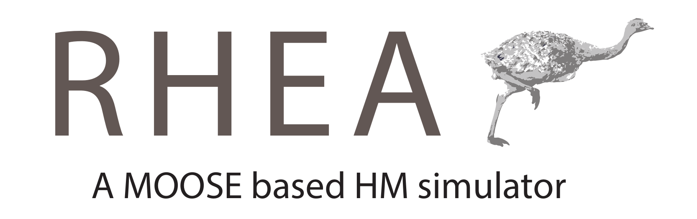
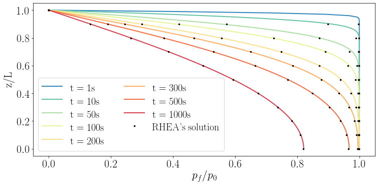

DESCRIPTION OF RHEA BY JOSE

# Compilation

BY JOSE

# Testing RHEA

After compilation, navigate to the top-level directory (usually `~/projects/RHEA/`) and run the tests using the command

```
./run_tests
```

If RHEA has compiled successfully, you should see various output, ending with the line

```
2 passed, 0 skipped, 0 pending, 0 failed
```

# Examples

## Terzaghi consolidation

Consolidation of a soil sample due to an external load was studied by Terzaghi.  JOSE TO FILL IN DETAILS.

The RHEA files for this scenario are found in `test/tests/terzaghi/`.  There are three important files:

- `test/tests/terzaghi/Workflow_TerzaghiImportData.ipynb`.  This is a [Jupyter notebook](https://jupyter.org/) that creates files that define the hydraulic conductivity, porosity, bulk modulus and shear modulus throughout the Terzaghi soil sample.  In this case, these properties are homogeneous.  The files created are `K.data`, `p.data`, `L.data` and `G.data` (which are part of this repository, so you don't need to create them yourself).
- `test/tests/terzaghi/TerzaghiImportData.i`.  This is the RHEA input file.  Run it using the `rhea-opt` executable you created during compilation: `rhea-opt -i TerzaghiImportData.i`.
- `test/tests/terzaghi/plot_results.py`.  This is a python file that plots the results, demonstrating agreement between RHEA and the analytical formulae derived by Terzaghi:



PERHAPS JOSE WANTS TO REPLACE THIS FIG WITH THE NICE ONE IN THE PAPER.  IN THIS CASE, YOU SHOULD MODIFY plot_results.py accordingly, i think

## Consolidation of a heterogeneous sample

JOSE


