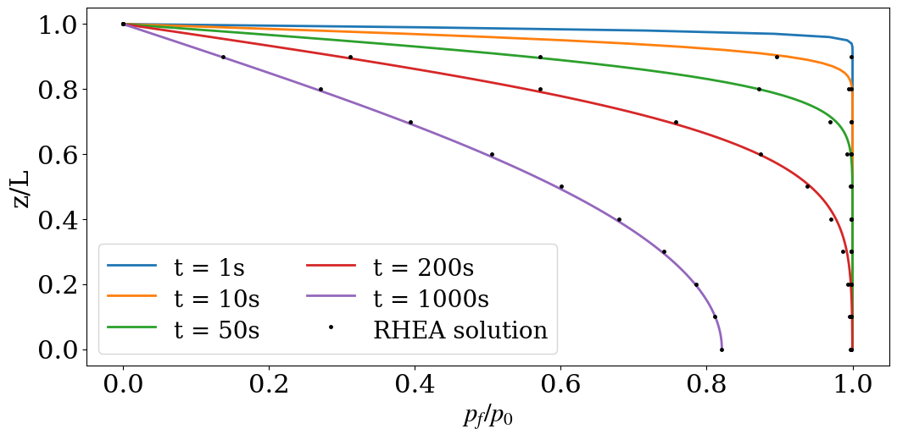

<p align="center">
 
</p>

## A verified numerical simulator for hydro-geomechanical heterogeneity based on [MOOSE](https://mooseframework.inl.gov/)


## About

RHEA (Real HEterogeneity App), is an open-source fully coupled finite element application capable of including element-resolution hydro-geomechanical properties in coupled simulations. The code was developed by [José Bastías](https://ingeo.agw.kit.edu/21_99.php) with small additions from [Andy Wilkins](https://research.csiro.au/mgt/andy-wilkins/) in a collaboration between Karlsruhe Institute of Technology (KIT) and the Commonwealth Scientific and Industrial Research Organisatio (CSIRO).

RHEA is a MOOSE based application, for more information visit [MOOSE Framework](https://mooseframework.inl.gov/). To use RHEA, you will need to have [installed MOOSE](https://mooseframework.inl.gov/getting_started/installation/index.html), which can take some time.

RHEA is released under the GNU Lesser General Public License Version 2.1.  See the [LICENSE](LICENSE) file for details.

## Getting started

For system requirements and MOOSE installation visit [Getting Started](https://mooseframework.inl.gov/getting_started/installation/index.html) page of the MOOSE framework.

### Clone RHEA

The stable version of RHEA can be cloned directly for the GitHub repository. As usual in any MOOSE based app, RHEA will be located by default in the `cd ~/projects` foulder generated during the installation of MOOSE.

```
cd ~/projects
git clone https://github.com/josebastiase/RHEA.git
cd ~/projects/RHEA
git checkout master
```

### Compile and test RHEA

As any MOOSE based app, you first need to compile RHEA 

```
cd ~/projects/RHEA
make -j4
```

and then test RHEA

```
cd ~/projects/RHEA
./run_tests
```
If RHEA has compiled successfully, you should see various output, ending with the line

```
2 passed, 0 skipped, 0 pending, 0 failed
```

## Examples

### Terzaghi's consolidation problem

In Terzaghi’s original theoretical work (von Terzaghi, 1923), which was inspired by the measurements of delayed deformations in a compression test on a clay sample, the pore fluid and the soil particles were both assumed to be incompressible, so that the only mechanism of deformation was a rearrangement of the particles. In modern presentations, these assumptions are no longer made, and this generalised theory will be used here. The relevant parameters used in this model are as follows.

Hydraulic properties

| Parameter | Symbol | Value | Unit | 
| :--- | :---: | :---:         |:---| 
| Hydraulic conductivity | k | 1.0E-4  | m/s |
| Porosity | n | 0.2 | - |

Mechanical properties

| Parameter | Symbol | Value | Unit | 
| :--- | :---: | :---:         |:---| 
| Shear modulus | G | 6.25E7 | Pa |
| Bulk modulus| K | 8.4E7 | Pa |
| Biot's coefficient | a | 0.9 | - |

Fluid properties

| Parameter | Symbol | Value | Unit | 
| :--- | :---: | :---:         |:---| 
| Water bulk modulus| K_f | 2.2E7 | Pa |
| Volumetric weigth | y | 1.0E4 | m/s  |

System's characteristics

| Parameter | Symbol | Value | Unit | 
| :--- | :---: | :---:         |:---| 
| Load| q | 1.0E3 | Pa |
| System's depth | h | 1.0E2 | m |
| time| t | - | s |

The RHEA files for this scenario are found in `test/tests/terzaghi/`. There are three important files:

1.  `test/tests/terzaghi/Workflow_TerzaghiImportData.ipynb`.  This is a [Jupyter notebook](https://jupyter.org/) that creates files that define the hydraulic conductivity, porosity, bulk modulus and shear modulus throughout the Terzaghi soil sample.  In this case, these properties are homogeneous.  The files created are `K.data`, `p.data`, `L.data` and `G.data` (which are part of this repository, so you don't need to create them yourself).

2. `test/tests/terzaghi/TerzaghiImportData.i`.  This is the RHEA input file.  Run it using the `rhea-opt` executable you created during compilation: `../../../rhea-opt -i TerzaghiImportData.i`.

3. `test/tests/terzaghi/plot_results.py`.  This is a python file that plots the results, demonstrating agreement between RHEA and the analytical formulae derived by Terzaghi, as shown below.  If you require more precise agreement, simply decrease the time-step size in `TerzaghiImportData.i`.

<p align="center">
 
</p>


### Consolidation of a heterogeneous sample

The Terzaghi consolidation problem may be generalised to hterogeneous, layered samples.  The aim is to test Rhea's import data material properties with different layers and sharp gradients.  Contrasting values of hydraulic conductivities are considerated

| Parameter | Symbol | Value | Unit | 
| :--- | :---: | :---:         |:---| 
| Hydraulic conductivity layer 1 | k | 1.0E-4  | m/s |
| Hydraulic conductivity layer 2 | k | 1.0E-8  | m/s |

The RHEA files for this scenario are found in `test/tests/terzaghi_layers/`. The important files are:

1.  `test/tests/terzaghi_layers/Workflow_TerzaghiImportDataLayers.ipynb`. [Jupyter notebook](https://jupyter.org/) that creates the files containing the sptially-varying properties that are going to be used by RHEA. The files created are `K.data`, `p.data`, `L.data` and `G.data`.

2. `test/tests/terzaghi_layers/TerzaghiImportDataLayers.i`.  This is the RHEA input file.  Run it using the `rhea-opt` executable you created during compilation: `../../../rhea-opt -i TerzaghiImportDataLayers.i`.

3. `test/tests/terzaghi_layers/plot_results.py`.  This is a python file that plots the results, demonstrating agreement between RHEA and the analytical formulae derived by Hickson et al., as shown below.  If you require more precise agreement, simply decrease the time-step size in `TerzaghiImportDataLayers.i`.


<p align="center">
 
</p>

## Support

If you encounter difficulties at any step, you can ask for help on the [MOOSE GitHub](https://github.com/idaholab/moose/discussions) discussions.

## References

von Terzaghi, K.: Die Berechnug der Durchlassigkeit des Tones aus dem Verlauf der hydromechanischen Spannungserscheinungen, Sitzungs-470ber. Akad. Wiss.(Wien). Math.-Naturwiss. Kl., Abt. Iia, 132, 125–138, 1923

Hickson, R., Barry, S., and Mercer, G.: Critical times in multilayer diffusion. Part 1: Exact solutions, International Journal of Heat and MassTransfer, 52, 5776–5783, 2009.

## Cite

Paper to be added.
